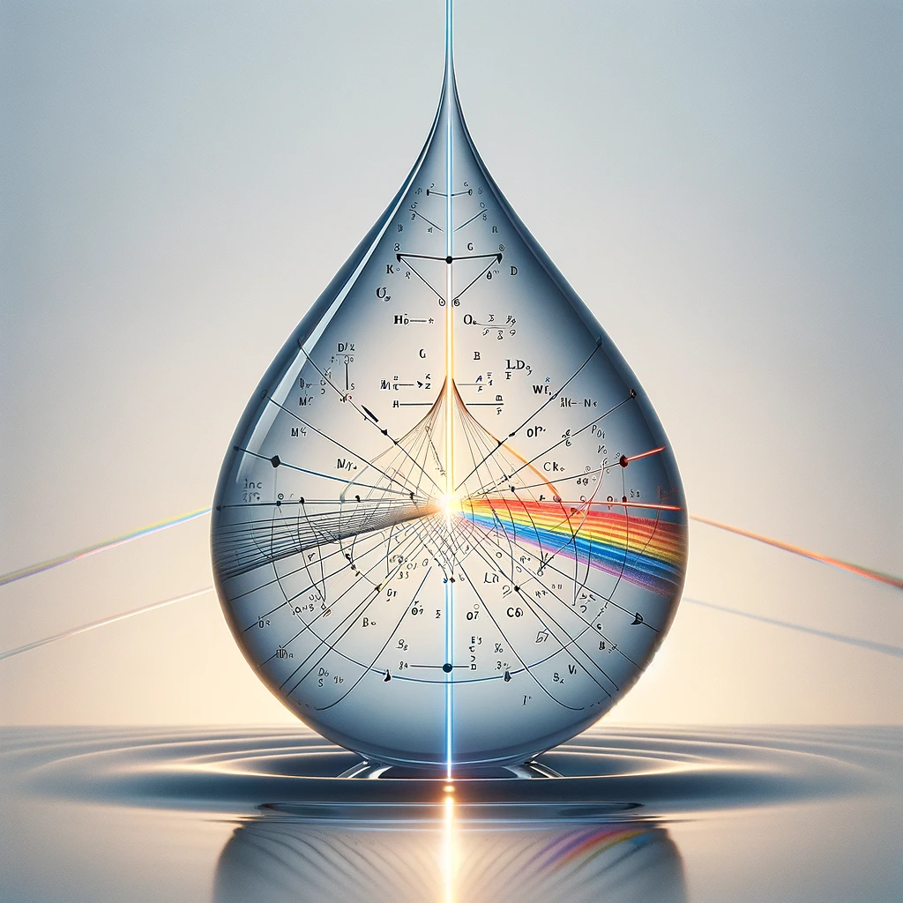

    

<h1 align="center">Rainbow Visualization Tool</h1>
<h3 align="center">Somewhere Within the Rainbow</h3>

## Introduction
This project presents an interactive tool to visualize and understand the mechanics of a rainbow, specifically focusing on the calculus involved in the refraction and reflection of different wavelengths of light(colors) that create this natural phenomenon. The tool leverages several datasets to provide a dynamic and interactive plotting experience.

## Motivation
The motivation behind this project is to demystify the complex process of rainbow formation through an engaging and educational tool. I learned about this process in my calculus class at ENMU and couldn't fully wrap my head around how it all worked till creating this. This tool aims to make the scientific principles behind rainbows accessible to a broader audience, regardless of their background.

## Libraries Used
- Flask
- Matplotlib
- JSON
- Sympy
- Numpy
- math

## Files in the Repository
- `app.py`: The main Flask application file containing the backend logic for the interactive plots.
- `main.py`: The file that has the calculation functions to find the vectors for the light rays given different values of alpha
- `main_notebook.ipynb`: A Jupyter Notebook to test and interact with the design using live calculations (Not pre-rendered)
- `exaggerated_rainbow_data.json`: A dataset providing exaggerated representations of rainbow light paths.
- `exaggerated_rainbow_data_SMALL.json`: A smaller version of the exaggerated rainbow dataset.
- `rainbow_data_SMALL.json`: A smaller dataset for basic rainbow data.
- `rainbow_data.json`: The primary dataset containing detailed data points of rainbow formation.
- `templates/index.html`: HTML template for the web interface.
- `static/`: Folder containing CSS and JavaScript files for the web interface.

## Analysis Summary
The interactive plots generated by this tool offer a detailed visualization of how different wavelengths of light bend and reflect within water droplets to create a rainbow. Users can adjust parameters to see how these changes affect the appearance and intensity of the rainbow.

## Acknowledgements
This project was inspired by Dr. Brian Pasko, my calculus professor at ENMU. 

As well as this article decribing the whole process in detail:
Janke, S. (1999). Somewhere Within the Rainbow (UMAP). Consortium for Mathematics and its Applications (COMAP). https://www.comap.com/membership/member-resources/item/somewhere-within-the-rainbow-umap

## How to Run
To run this tool locally in a Jupyter Notebook:
1. Set up you Jupyter enviroment to meet your needs. Ensure you have Python and the necessary libraries installed.
2. Copy `Main_notebook.ipynb` 
3. Run all of the cells and the interactive plot should show up at the bottom. (this method calculates "live" so it will be slow, be patient)

To run this tool locally in the browser:
1. Ensure you have Python and the necessary libraries installed.
2. Clone this repository to your local machine.
3. Navigate to the cloned directory and run `python app.py` in your terminal.
4. Open your web browser and go to `http://localhost:5000`.

To pre-render your own data for browser runs:
1. Ensure you have Python and the necessary libraries installed.
2. Clone this repository to your local machine.
3. Navigate to the cloned directory and run edit `toJSON.py` to meet your sepecific needs. (Currently set up to output vector data from `main.py`)

---

